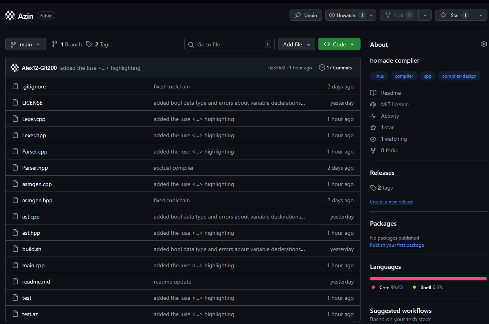
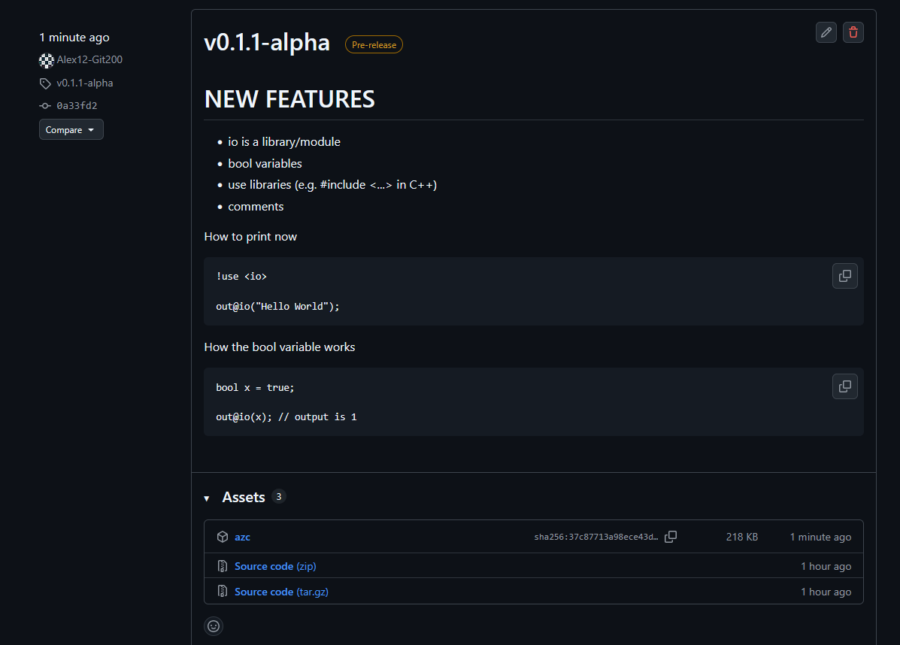

# How to Install Azin
---

### Browser (Recommended)

1. Go to the GitHub repository: [https://github.com/Alex12-Git200/Azin](https://github.com/Alex12-Git200/Azin)

   

2. Click **Releases**

   

3. Download the latest **`azc`** file.

---

### Setup

1. Move the downloaded **`azc`** file into your project folder.

2. Create a file with the `.az` extension and write some Azin code.

   

---

### Dependencies (Linux / WSL)

Before running Azin, install the required dependencies  
(**Debian / Ubuntu**):

```bash
sudo apt install g++ gcc nasm
```

## VSCode extension

To download the VSCode suppport extension, go to its [page](https://marketplace.visualstudio.com/items?itemName=Alex12-Git200.azin-language-support) or just search 'Azin' in VSCode extensions and it will be the top result
